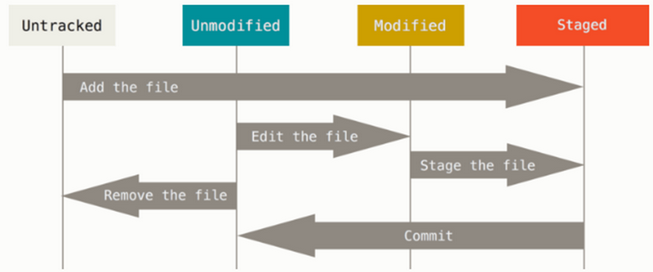

# BB Talk - Git/Versionamento

## Apresentação

* Engenheiro de Dados na Let's Code
* Entrada na Let's como Cientista de Dados
* Professor em cursos de python e Data Science
* Formado em Eng. de Petróleo POLI-USP
* Graduando em Sistemas de Informação EACH-USP
  

# 1. Git - Versionamento

## O que é versionar?

Controle de versionamento é feito por sistemas que registram mudanças em arquivos ao longo do tempo para que possamos recuperar ou acessar determinadas versões, quando quisermos. Não é obrigatório que esses arquivos sejam necessariamente arquivos de código, porém, é comum que esse termo apareça relacionado à área de desenvolvimento.<br>
Em resumo, se um erro passou a acontecer, podemos voltar para quando esse erro não acontecia.

## O que é Git?

Git é um sistema de versionamento de código, que interpreta os dados recebidos como uma série de snapshots, como se fossem **fotos do estado do seu código no momento da captura**.<br>
Para o Git, toda vez que você salva o estado do seu projeto, essa "foto” é guardada assim como a referência/ou caminho até essa foto. Porém, se algum dos arquivos do seu projeto não foi alterado, quando comparado ao estado da captura anterior, o Git não guarda a nova captura, apenas mantém a referência para o arquivo idêntico anteriormente guardado.<br>
**A maioria das operações feitas pelo Git são locais**, em apenas algumas situações precisamos acessar informações por rede. Git utiliza recursos e arquivos armazenados localmente. E por isso, boa parte das operações são praticamente instantâneas dado que o tempo de resposta é reduzido por acessar históricos em seu próprio computador. 

## Os 3 estados do Git

Os três principais estados são: modified, staged  e commited.<br>
* **modified**: significa que o arquivo foi modificado mas ainda não passou por commit, e portanto, o Git ainda não registrou a modificação<br> 
* **staged**: significa que o estado atual do arquivo foi marcado para ser gravado no próximo registro (commit)<br> 
* **committed**: o estado do arquivo foi armazenado com sucesso

## Diretório .git

O diretório `.git` é onde o Git armazena os metadados e o banco de dados de objetos do seu projeto. Esta é a parte mais importante do Git, e é o que é copiado quando você clona um repositório de outro computador.


## Fluxo de trabalho básico do Git 

1. Você modifica os arquivos em sua árvore de trabalho;
2. Você prepara seletivamente apenas as alterações que deseja que façam parte do seu próximo commit, o que adiciona apenas essas alterações à área de staging;
3. Você faz um commit, que pega os arquivos como eles estão na área de staging e armazena essa captura permanentemente em seu diretório Git;
4. Por fim, atualiza o repositório remoto para que as modificações fiquem disponíveis para outros colaboradores.

# 2. Instalando e configurando o Git

Os três principais sistemas operacionais têm o Git disponível para download, vamos ver como instalar para cada sistema. 

## Instalando no Linux

Se você deseja instalar as ferramentas básicas do Git no Linux por meio de um instalador binário, geralmente pode ser feito por meio da ferramenta de gerenciamento de pacotes que acompanha sua distribuição. Se você estiver no Fedora (ou qualquer distribuição baseada em RPM intimamente relacionada, como RHEL ou CentOS), você pode usar dnf:

```sh
$ sudo dnf install git-all
```
Se você estiver em uma distribuição baseada em Debian, como Ubuntu, tente apt:
```sh
$ sudo apt install git-all
```

## Instalando no macOS

Existem várias maneiras de instalar o Git em um Mac. O mais fácil é provavelmente instalar as ferramentas de linha de comando do Xcode. No Mavericks (10.9) ou superior, você pode fazer isso simplesmente tentando executar o git a partir do terminal pela primeira vez.

```sh
$ git --version
```
Se você ainda não o tiver instalado, ele solicitará que você o instale.

Se você deseja uma versão mais atualizada, também pode instalá-la por meio de um instalador binário. Um instalador do macOS Git é mantido e está disponível para download no site do Git, em https://git-scm.com/download/mac.

## Instalando no Windows

Existem também algumas maneiras de instalar o Git no Windows. A versão oficial está disponível para download no site do Git. Basta acessar https://git-scm.com/download/win e escolher a versão para download.

## Onde usar o git?

Após a instalação, como podemos utilizar o Git? Existem ferramentas de linha de comando e muitas interfaces gráficas de usuário com recursos variados. A linha de comando é o único lugar em que você pode executar todos os comandos do Git — a maioria das GUIs (Graphical User Interface - Interface Gráfica de Usuário) implementa apenas um subconjunto parcial da funcionalidade do Git por simplificação.<br>
Algumas configurações iniciais do Git são necessárias, de maneira geral trazem certa personalização ao seu ambiente.

## Configuração do Git

Para personalizar seu ambiente Git, precisamos configurar alguns pontos apenas uma vez para uma dada instalação.<br>
 
### Sua identidade

A primeira coisa que você deve fazer ao instalar o Git é definir seu nome de usuário e endereço de e-mail. Isso é importante porque todo commit do Git usa essa informação e é imutavelmente incorporada aos commits que você começa a criar:

```sh
$ git config --global user.name "Bowie"
$ git config --global user.email bowie@example.com
```

Novamente, você precisa fazer isso apenas uma vez se passar a opção `--global`, porque o Git sempre usará essa informação para qualquer coisa que você fizer nesse sistema. Se você quiser substituir isso por um nome ou endereço de e-mail diferente para projetos específicos, poderá executar o comando sem a opção `--global` quando estiver nesse projeto.<br>
Muitas das ferramentas GUI irão ajudá-lo a fazer isso quando você as executar pela primeira vez.

### Nome padrão de branch

Por padrão, o Git criará uma branch chamada master quando você criar um novo repositório com git init. A partir da versão 2.28 do Git, você pode definir um nome diferente para a branch inicial.
Para definir main como o nome da ramificação padrão, faça:
```sh
$ git config --global init.defaultBranch main
```

# 3. Repositórios do git

## Obtendo um repositório Git

Você normalmente obtém um repositório Git de duas maneiras:

1. Pegar um diretório local que não está sob controle de versão e transformá-lo em um repositório Git;
2. Clonar um repositório Git existente de outro lugar.

Em ambos os casos, você acaba com um repositório Git em sua máquina local, pronto para o trabalho.

## Inicializando um repositório em um diretório existente

Se você tem um diretório de projeto que atualmente não está sob controle de versão e deseja começar a controlá-lo com o Git, primeiro você precisa ir ao diretório desse projeto. Se você nunca fez isso, parece um pouco diferente dependendo de qual sistema você está executando:

* para Linux:
```sh
$ cd /home/user/my_project
```
* para macOS:
```sh
$ cd /Users/user/my_project
```
* para Windows:
```sh
$ cd C:/Users/user/my_project
```

e digite:

```sh
$ git init
```

Isso cria um novo subdiretório chamado `.git` que contém todos os seus arquivos de repositório necessários — um esqueleto de repositório Git. 

## Clonar um repositório existente

Se você deseja obter uma cópia de um repositório Git existente — por exemplo, um projeto para o qual gostaria de contribuir — o comando que você precisa é `git clone`. O Git receberá uma cópia completa de quase todos os dados que o servidor possui. Cada versão de cada arquivo para o histórico do projeto é baixada por padrão quando você executa `git clone`.

Por exemplo, se você deseja clonar o projeto do Git chamado `bb-talk`, você pode fazer assim:

```sh
$ git clone https://github.com/olvbruno/bb-talk.git
```

Isso cria um diretório chamado `bb-talk`, inicializa um diretório .git dentro dele, obtém todos os dados desse repositório e deixando uma cópia de trabalho da versão mais recente disponível.
Se você entrar no novo diretório `bb-talk` que acabou de ser criado, você verá os arquivos do projeto lá, prontos para serem trabalhados ou usados.
Se você quiser clonar o repositório em um diretório chamado algo diferente de `bb-talk`, você pode especificar o novo nome do diretório como um argumento adicional:

```sh
$ git clone https://github.com/olvbruno/bb-talk.git meu-bb-talk
```

Esse comando faz a mesma coisa que o anterior, mas o diretório de destino é chamado meu-bb-talk.

Cada arquivo em seu diretório de trabalho pode estar em um dos dois estados: `rastreado` ou `não rastreado`. Arquivos rastreados são arquivos que estavam no último commit, bem como quaisquer arquivos em staging. Resumindo, **arquivos rastreados são arquivos que o Git conhece**.

# 4. Gravando mudanças no repositório

## Verificando o status de seus arquivos

A principal ferramenta que você usa para determinar quais arquivos estão em qual estado é o comando `git status`. Se você executar este comando diretamente após um clone, deverá ver algo assim:

```sh
$ git status
On branch master
Your branch is up-to-date with 'origin/main'.
nothing to commit, working tree clean
```

Isso significa que você tem um diretório de trabalho limpo; em outras palavras, nenhum de seus arquivos rastreados está modificado. O Git também não encontrou nenhum arquivo não rastreado, ou eles seriam listados ali. Por fim, o comando informa **em qual branch você está** e informa que ele não divergiu da mesma branch no servidor. Por enquanto, essa branch é sempre `main` ou `master` caso não tenha configurado um novo nome.

## Tracking (rastreamento) de novos arquivos

Após modificarmos ou até inserirmos arquivos em nosso diretório de trabalho, é preciso "passá-los" para a área de staging, uma forma de preparar o que enviaremos para o próximo commit.

Para começar a rastrear um novo arquivo, você usa o comando `git add`. Para começar a rastrear o arquivo `README_BB_TALK`, você pode executar:

```sh
$ git add README_BB_TALK
```

Você pode dizer que está staged porque está sob o título "Alterações a serem confirmadas (commited)". Se você fizer commit neste ponto, a versão do arquivo no momento em que você executou `git add` é a que estará no snapshot histórico subsequente. O comando `git add` recebe um nome de caminho para um arquivo ou um diretório; **se for um diretório, o comando adiciona todos os arquivos nesse diretório recursivamente**.

O comando `add` siginifica: **“adicione precisamente este conteúdo ao próximo commit”**

A figura abaixo mostra quais processos estamos tratando:




# 5. Git diff, commit

Se você quiser saber exatamente o que mudou, não apenas quais arquivos foram alterados — você pode usar o comando `git diff`. Você provavelmente o usará com mais frequência para responder a essas duas perguntas:

* O que você mudou, mas ainda não está staged?
* E o que você passou para staging que está prestes a receber commit? 

Embora o `git status` responda a essas perguntas geralmente listando os nomes dos arquivos, o git diff mostra as linhas exatas adicionadas e removidas.

## Git diff

Esse comando compara o que está em seu diretório de trabalho com o que está em sua área staging. O resultado informa as alterações que você fez e ainda não passou para a área de staging.
Se você quiser ver o que você passou para staging para o próximo commit, você pode usar `git diff --staged`. Este comando compara suas alterações em staging com seu último commit.

É importante notar que o `git diff` por si só **não mostra todas as alterações feitas desde seu último commit — apenas as alterações que ainda não estão em staging**. Se você passou para staging todas as suas alterações, git diff não fornecerá nenhuma saída.

Após um fluxo comum de trabalho precisamos salvar as alterações feitas segundo a visão do Git, em outras palavras, criaremos uma nova versão do trabalho que estamos desenvolvendo para comparações futuras ou recuperação de versões estáveis. 

## Git commit

Com as alterações devidamente mapeadas para a área de staging. Lembre-se de que qualquer coisa que ainda não esteja em staging— qualquer arquivo que você criou ou modificou e não executou o `git add` desde que você os editou — não irá para este commit. Eles permanecerão como arquivos modificados em seu disco. 

Nesse caso, digamos que na última vez que você executou o `git status`, você viu que tudo estava em staging, então você está pronto para dar commit em suas alterações. A maneira mais simples de fazer um commit é digitar git commit:

```sh
$ git commit -m "teste bb-talk"
```

Agora você criou seu primeiro commit! Você pode ver que o commit deu a você alguma saída sobre si mesmo: 

* qual branch você fez o commit (master);
* qual checksum SHA-1 o commit tem (463dc4f);
* quantos arquivos foram alterados e estatísticas sobre linhas adicionadas e removidas no commit.
  
Lembre-se de que o commit grava o snapshot que você configurou em sua área de staging. Qualquer coisa que você não passou para staging ainda está lá modificada; você pode fazer outro commit para adicioná-la ao seu histórico. Toda vez que você realiza um commit, você está gravando uma captura do seu projeto para o qual você pode reverter ou comparar mais tarde.

# 6. Git log, restore

## Visualizando o histórico de commits

Depois de ter criado vários commits, ou se você clonou um repositório com um histórico de commits existente, você provavelmente vai querer olhar para trás para ver o que aconteceu. A ferramenta mais básica e poderosa para fazer isso é o comando `git log`.

Esses exemplos usam um projeto muito simples chamado “simplegit”. Para obter o projeto, execute:

```sh
$ git clone https://github.com/schacon/simplegit-progit
```

Ao executar o git log neste projeto, você deve obter uma saída parecida com esta:

```sh
$ git log
commit ca82a6dff817ec66f44342007202690a93763949
Author: Scott Chacon <schacon@gee-mail.com>
Date:   Mon Mar 17 21:52:11 2008 -0700

    changed the version number

commit 085bb3bcb608e1e8451d4b2432f8ecbe6306e7e7
Author: Scott Chacon <schacon@gee-mail.com>
Date:   Sat Mar 15 16:40:33 2008 -0700

    removed unnecessary test code

commit a11bef06a3f659402fe7563abf99ad00de2209e6
Author: Scott Chacon <schacon@gee-mail.com>
Date:   Sat Mar 15 10:31:28 2008 -0700

    first commit
```

Por padrão, sem argumentos, o `git log` lista os commits feitos naquele repositório em ordem cronológica inversa; ou seja, os commits mais recentes aparecem primeiro.

Como você pode ver, este comando lista cada commit com sua soma de verificação SHA-1, o nome e e-mail do autor, a data escrita e a mensagem do commit.

Um grande número e variedade de opções para o comando git log estão disponíveis para mostrar exatamente o que você está procurando. Aqui, mostraremos alguns dos mais populares.<br>
Uma das opções mais úteis é `-p` ou `--patch`, que mostra a diferença (a saída do patch) introduzida em cada commit. Você também pode limitar o número de entradas de log exibidas, como usar `-2` para mostrar apenas as duas últimas entradas.

```sh 
$ git log -p -2
commit ca82a6dff817ec66f44342007202690a93763949
Author: Scott Chacon <schacon@gee-mail.com>
Date:   Mon Mar 17 21:52:11 2008 -0700

    changed the version number

diff --git a/Rakefile b/Rakefile
index a874b73..8f94139 100644
--- a/Rakefile
+++ b/Rakefile
@@ -5,7 +5,7 @@ require 'rake/gempackagetask'
 spec = Gem::Specification.new do |s|
     s.platform  =   Gem::Platform::RUBY
     s.name      =   "simplegit"
-    s.version   =   "0.1.0"
+    s.version   =   "0.1.1"
     s.author    =   "Scott Chacon"
     s.email     =   "schacon@gee-mail.com"
     s.summary   =   "A simple gem for using Git in Ruby code."

commit 085bb3bcb608e1e8451d4b2432f8ecbe6306e7e7
Author: Scott Chacon <schacon@gee-mail.com>
Date:   Sat Mar 15 16:40:33 2008 -0700

    removed unnecessary test code

diff --git a/lib/simplegit.rb b/lib/simplegit.rb
index a0a60ae..47c6340 100644
--- a/lib/simplegit.rb
+++ b/lib/simplegit.rb
@@ -18,8 +18,3 @@ class SimpleGit
     end

 end
-
-if $0 == __FILE__
-  git = SimpleGit.new
-  puts git.show
-end
```

Esta opção exibe as mesmas informações, mas com um diferencial logo após cada entrada. Isso é muito útil para revisão de código ou para navegar rapidamente pelo que aconteceu durante uma série de commits que um colaborador adicionou.

Você também pode usar uma série de opções de resumo com git log. Por exemplo, se você quiser ver algumas estatísticas abreviadas para cada commit, você pode usar a opção `--stat`:

```sh
$ git log --stat
commit ca82a6dff817ec66f44342007202690a93763949
Author: Scott Chacon <schacon@gee-mail.com>
Date:   Mon Mar 17 21:52:11 2008 -0700

    changed the version number

 Rakefile | 2 +-
 1 file changed, 1 insertion(+), 1 deletion(-)

commit 085bb3bcb608e1e8451d4b2432f8ecbe6306e7e7
Author: Scott Chacon <schacon@gee-mail.com>
Date:   Sat Mar 15 16:40:33 2008 -0700

    removed unnecessary test code

 lib/simplegit.rb | 5 -----
 1 file changed, 5 deletions(-)

commit a11bef06a3f659402fe7563abf99ad00de2209e6
Author: Scott Chacon <schacon@gee-mail.com>
Date:   Sat Mar 15 10:31:28 2008 -0700

    first commit

 README           |  6 ++++++
 Rakefile         | 23 +++++++++++++++++++++++
 lib/simplegit.rb | 25 +++++++++++++++++++++++++
 3 files changed, 54 insertions(+)
```

Como você pode ver, a opção `--stat` imprime abaixo de cada entrada de commit uma lista de arquivos modificados, quantos arquivos foram alterados e quantas linhas nesses arquivos foram adicionadas e removidas. Ele também coloca um resumo das informações no final.

Outra opção realmente útil é `--pretty`. Essa opção altera a saída do log para formatos diferentes do padrão. Alguns valores de opção pré-construídos estão disponíveis para uso. O valor oneline para esta opção imprime cada commit em uma única linha, o que é útil se você estiver vendo muitos commits. Além disso, os valores short, full e fuller mostram a saída aproximadamente no mesmo formato, mas com menos ou mais informações, respectivamente:

```sh
$ git log --pretty=oneline
ca82a6dff817ec66f44342007202690a93763949 changed the version number
085bb3bcb608e1e8451d4b2432f8ecbe6306e7e7 removed unnecessary test code
a11bef06a3f659402fe7563abf99ad00de2209e6 first commit
```
 
## Desfazendo coisas com git restore

O Git versão 2.23.0 introduziu um novo comando: `git restore`. Um novo comando para fazer a operação de `undo`, ou seja, desfazer uma operação feita.

### Removendo um arquivo de staging 

Podemos utilizar `git restore --staged <file>` para desfazer o stage. Então, vamos usar esse conselho para remover o arquivo README.md:

```sh
$ git restore --staged README.md
```
O arquivo aparece novamente como modificado.

### Desmodificando um arquivo modificado com git restore

E se você perceber que não deseja manter suas alterações no arquivo README.md? Como você pode desmodificá-lo facilmente —  revertê-lo para o que parecia quando você fez o último commit (ou inicialmente clonado, ou como você o colocou em seu diretório de trabalho)? Vejamos:

```sh
$ git restore CONTRIBUTING.md
```
Agora o arquivo aparece de acordo com a última versão registrada por commit ou como foi clonado.


# 7. Repositórios remotos

## Trabalhando com repositórios remotos

Para poder colaborar em qualquer projeto Git, você precisa saber como gerenciar seus repositórios remotos. Repositórios remotos são versões do seu projeto que estão hospedadas na Internet ou rede em algum lugar.

Você pode ter vários deles, cada um dos quais geralmente é de somente leitura ou leitura/gravação. Colaborar com outras pessoas envolve gerenciar esses repositórios remotos e enviar e extrair dados de e para eles quando você precisar compartilhar o trabalho. 

 
### Mostrando seus repositórios remotos

Para ver quais servidores remotos você configurou, você pode executar o comando `git remote`. Ele lista os nomes abreviados de cada identificador remoto que você especificou. Se você clonou seu repositório, você deve pelo menos ver origin — esse é o nome padrão que o Git dá ao servidor do qual você clonou:

```sh
$ git clone https://github.com/schacon/ticgit

Cloning into 'ticgit'...
remote: Reusing existing pack: 1857, done.
remote: Total 1857 (delta 0), reused 0 (delta 0)
Receiving objects: 100% (1857/1857), 374.35 KiB | 268.00 KiB/s, done.
Resolving deltas: 100% (772/772), done.
Checking connectivity... done.
$ cd ticgit
$ git remote
origin
```
 
## Adicionando repositórios remotos

Para adicionar um novo repositório Git remoto como um nome abreviado que você pode referenciar facilmente, execute `git remote add <shortname> <url>`:

```sh
$ git remote
origin
$ git remote add teste https://github.com/olvbruno/bb-talk.git
```
 
# Fetching e Pulling de seus remotos

Para obter dados de seus projetos remotos, você pode executar:

```sh
$ git fetch <remote>
```

O comando vai para esse projeto remoto e extrai todos os dados desse projeto remoto que você ainda não possui. Depois de fazer isso, você deve ter referências a todas as ramificações desse remoto, que você pode mesclar ou inspecionar a qualquer momento.

Se você clonar um repositório, o comando adiciona automaticamente esse repositório remoto com o nome “origin”. Portanto, `git fetch origin` busca qualquer novo trabalho que tenha sido enviado para esse servidor desde que você o clonou (ou foi obtido pela última vez). 

**É importante observar que o comando git fetch apenas baixa os dados para o seu repositório local — ele não os mescla automaticamente com nenhum de seus trabalhos ou modifica o que você está trabalhando no momento**. Você precisa mesclá-lo manualmente em seu trabalho quando estiver pronto.

Se sua branch atual estiver configurada para rastrear uma branch remota, você pode usar o comando `git pull` para buscar automaticamente e então mesclar essa branch remota em sua branch atual.
Este pode ser um fluxo de trabalho mais fácil ou confortável para você; e por padrão, o comando `git clone` configura automaticamente seu branch master local para rastrear o branch master remoto (ou qualquer que seja o nome do branch padrão) no servidor do qual você clonou. A execução do `git pull` geralmente busca dados do servidor do qual você clonou originalmente e automaticamente tenta mesclá-los no código em que você está trabalhando no momento.
 
# Pushing para seus repositórios remotos

Quando você tem seu projeto em um ponto que deseja compartilhar, precisa executar um  push. O comando para isso é simples: `git push <remote> <branch>`. Se você quiser enviar sua branch master para seu servidor de origem (novamente, a clonagem geralmente configura ambos os nomes para você automaticamente), então você pode executar isso para enviar quaisquer commits que você fez de volta para o servidor:

```sh
$ git push origin master
```
Este comando funciona apenas se você clonou de um servidor ao qual você tem acesso de gravação e se ninguém tiver feito push nesse meio tempo. Se você e outra pessoa clonarem ao mesmo tempo e fizerem push e então você enviar, seu push será rejeitado. Você terá que buscar o trabalho deles primeiro e incorporá-lo ao seu antes de poder dar push.

## Inspecionando um remoto

Se você quiser ver mais informações sobre um remoto específico, você pode usar o comando `git remote show <remote>`. Se você executar este comando com um nome abreviado específico, como origin, obterá algo assim:
```sh
$ git remote show origin
* remote origin
  Fetch URL: https://github.com/schacon/ticgit
  Push  URL: https://github.com/schacon/ticgit
  HEAD branch: master
  Remote branches:
    master                               tracked
    dev-branch                           tracked
  Local branch configured for 'git pull':
    master merges with remote master
  Local ref configured for 'git push':
    master pushes to master (up to date)
```
Ele lista a URL do repositório remoto, bem como as informações da branch. O comando informa que, se você estiver na branch master e executar o git pull, ele mesclará automaticamente a branch master do remoto no local depois que ele for buscado. Ele também lista todas as referências remotas que retirou.

## Renomeando e removendo remotos

Você pode executar `git remote rename` para alterar o nome abreviado de um controle remoto. Por exemplo, se você quiser renomear origin para exemplo, você pode fazê-lo com `git remote rename`:
```sh
$ git remote rename teste exemplo
$ git remote
exemplo
```

Se você deseja remover um controle remoto por algum motivo — você moveu o servidor ou não está mais usando um espelho específico, ou talvez um colaborador não esteja mais contribuindo — você pode usar `git remote remove` ou `git remote rm`:

```sh
$ git remote remove exemplo
$ git remote
origin
```

Depois de excluir a referência a um remoto dessa maneira, todas as ramificações de rastreamento remoto e as definições de configuração associadas a esse remoto também serão excluídas.


# . Git branch

# 10. Merging branches

# Referência

Documentação do Git: https://git-scm.com/book/en/v2
